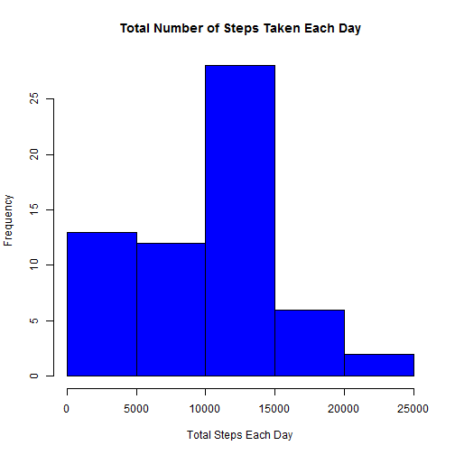
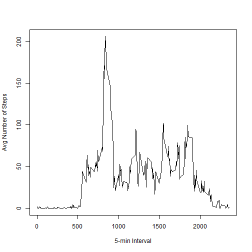
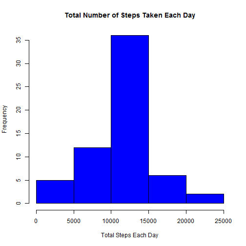
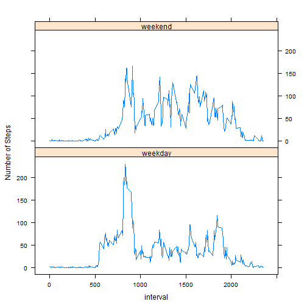

```r
knitr::opts_chunk$set(echo=TRUE)
```
##Loading and preprocessing the data  


```r
library(data.table)
#setwd("./repdata-data-activity")
data <- read.csv("activity.csv",head=TRUE,sep=",")
data$date <- as.Date(as.character(data$date, "%Y-%m-%d"))
data <- data.table(data)
```

##What is mean total number of steps taken per day?
1.  To find the total number of steps per day and plot the histogram  
Note: I removed the instances where there are 0 total steps taken in a given day.  These are due to having source data with NA for all intervals for that given day which should be excluded from the analysis since they are not representative of the true behaviour   

```r
sumdata <- data[,sum(steps,na.rm=TRUE), by=date]
setnames(sumdata,2, "TotalSteps")
#sumdata <- sumdata[sumdata$TotalSteps>0,]
hist(sumdata$TotalSteps, col="blue", xlab = "Total Steps Each Day",main="Total Number of Steps Taken Each Day")
```

 
  
2.  Calculate and report the mean and median total number of steps taken per day  
NOTE: Pls see note above at the top on decision not to remove 0 steps from the calculation

```r
meansteps <- mean(sumdata$TotalSteps,na.rm=TRUE)
mediansteps <-median(sumdata$TotalSteps,na.rm=TRUE)
```
The mean total number of steps taken per day is 9354.2295  
The median total number of steps taken per day is **10395**


## What is the average daily activity pattern?

```r
avgstepsint <- data[,mean(steps,na.rm=TRUE),by=interval]
setnames(avgstepsint,2, "AvgSteps")
with(avgstepsint,plot(interval,AvgSteps,typ="l",xlab ="5-min Interval", ylab="Avg Number of Steps"))
```

 

```r
maxstepsint<-avgstepsint[avgstepsint$AvgSteps == max(avgstepsint$AvgSteps),][[1]]
```
Interval **835**, on average across all days, contains the maximum number of steps.  

##Imputing missing values  
1.  Calculate and report the total number of missing values in the dataset (i.e. the total number of rows with NAs)

```r
NArows <- data[is.na(data$steps),]
totalNArows <- nrow(NArows)
```

The total number of missing values in the dataset is **2304**

2.  Devise a strategy for filling in all of the missing values in the dataset. The strategy does not need to be sophisticated. For example, you could use the mean/median for that day, or the mean for that 5-minute interval, etc.  
3.  Create a new dataset that is equal to the original dataset but with the missing data filled in.

```r
meanintbydate <- data[,mean(steps,na.rm=TRUE),by=interval]
meanintbydate <-data.frame(meanintbydate)
NArows <-data.frame(NArows)

results <- merge(meanintbydate,NArows, all=TRUE)

results<-results[,-c(3)]
setnames(results,2,"steps")
results<-results[,c(2,3,1)]

#remove those rows with NA from original data set
noNAdata <- data[!is.na(data$steps),]
#combine the rows with the results from above
final <- rbind(results,noNAdata)
```


```r
sumdata <- final[,sum(steps,na.rm=TRUE), by=date]
setnames(sumdata,2, "TotalSteps")
hist(sumdata$TotalSteps, col="blue", xlab = "Total Steps Each Day",main="Total Number of Steps Taken Each Day")
```

 

```r
meansteps <- mean(sumdata$TotalSteps,na.rm=TRUE)
mediansteps <-median(sumdata$TotalSteps,na.rm=TRUE)
```
The mean total number of steps taken per day is **1.0766 &times; 10<sup>4</sup>**  
The median total number of steps taken per day is **1.0766 &times; 10<sup>4</sup>**
## Are there differences in activity patterns between weekdays and weekends?


```r
final$date <- weekdays(final$date)
final[!grepl("Saturday|Sunday",final$date),]$date <- "weekday"
final[!grepl("weekday",final$date),]$date <- "weekend"
final$date <-factor(final$date)
avgdata <- final[,mean(steps),by=c("date","interval")]
setnames(avgdata ,3,"AvgSteps")

library(lattice) 
xyplot(AvgSteps ~interval | date, typ="l" , ylab="Number of Steps", data = avgdata, layout = c(1, 2))
```

 
